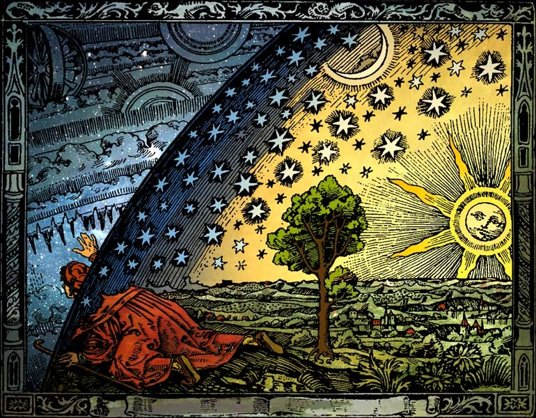

<!--
*** Thanks for checking out the Best-README-Template. If you have a suggestion
*** that would make this better, please fork the repo and create a pull request
*** or simply open an issue with the tag "enhancement".
*** Thanks again! Now go create something AMAZING! :D
***
***
***
*** To avoid retyping too much info. Do a search and replace for the following:
*** axgtz, rgtzgn@gmail.com, JorgeBarMza, n-body-simulation, jorgebarmza@gmail.com, n-body simulation, An interactive 3D web app to visualize celestial mechanics.
-->


<!-- PROJECT SHIELDS -->
<!--
*** I'm using markdown "reference style" links for readability.
*** Reference links are enclosed in brackets [ ] instead of parentheses ( ).
*** See the bottom of this document for the declaration of the reference variables
*** for contributors-url, forks-url, etc. This is an optional, concise syntax you may use.
*** https://www.markdownguide.org/basic-syntax/#reference-style-links
-->
[![Contributors][contributors-shield]][contributors-url]
[![MIT License][license-shield]][license-url]

<!-- PROJECT LOGO -->
<br />
<p align="center">
  <a href="https://github.com/JorgeBarMza/n-body-simulation">
    
  </a>

  <h3 align="center"><i>n</i>-body simulation</h3>

  <p align="center">
    A 3D web app to visualize celestial mechanics.
    <br />
    <a href="https://jorgebarmza.github.io/n-body-simulation/">View Demo</a>
    ·
    <a href="https://github.com/JorgeBarMza/n-body-simulation/issues">Report Bug or Request Feature</a>
  </p>
</p>


<!-- TABLE OF CONTENTS -->
<details open="open">
  <summary><h2 style="display: inline-block">Table of Contents</h2></summary>
  <ol>
    <li>
      <a href="#about-the-project">About The Project</a>
      <ul>
        <li><a href="#built-with">Built With</a></li>
        <li><a href="#math">Math</a></li>
        <li><a href="#graphics">Graphics</a></li>
      </ul>
    </li>
    <li>
      <a href="#getting-started">Getting Started</a>
      <ul>
        <li><a href="#prerequisites">Prerequisites</a></li>
        <li><a href="#installation">Installation</a></li>
      </ul>
    </li>
    <li><a href="#license">License</a></li>
    <li><a href="#contact">Contact</a></li>
    <li><a href="#acknowledgements">Acknowledgements</a></li>
  </ol>
</details>


<!-- ABOUT THE PROJECT -->
## About The Project

An interactive 3D web app that simulates a dynamical system of particles under the influence of gravity. 

### Demo Captures

<p align="center">

<p/>

<p align="center">
Capture 1. Periodic configuration.
<p/>

<p align="center">

</p>

<p align="center">
Capture 2. Chaotic state with velocity vectors.
<p/>

### Built With

* [ODEX](https://github.com/littleredcomputer/odex-js)
* [Three.js](https://threejs.org/)
* [Browserify](http://browserify.org/)
* [ThreeDatGUI](https://www.npmjs.com/package/three-dat.gui)
* [ThreeMeshLine](https://www.npmjs.com/package/three.meshline)

### Math
<!-- 
Latex
F_{ij}=\frac{Gm_im_j}{{\| r_j - r_i \|}^2} \cdot 
\frac{(r_j - r_i)}{\| r_j - r_i \|} = 
\frac{Gm_im_j(r_j-r_i)}{{\| r_j - r_i \|}^3}

m_i {r_i}'' = \sum_{\substack{j = 1 \\ j \ne i}}^n F_{ij}

{r_i}'' = \sum_{\substack{j = 1 \\ j \ne i}}^n \frac{Gm_j(r_j-r_i)}{{\| r_j-r_i \|}^3}
-->

The *n*-body problem consists of predicting the movement of *n* particles given their masses, initial positions, and initial velocities.

Movement is influenced by gravitational force between the particles. 
The force exerted from mass *j* and received by mass *i* is described by Newton's law of gravity:

}{\|&space;r_j&space;-&space;r_i&space;\|}&space;=&space;\frac{Gm_im_j(r_j-r_i)}{{\|&space;r_j&space;-&space;r_i&space;\|}^3})

Where *G* is the gravitational constant, *r* is the position vector of a body as a function of time, and |v| denotes the euclidean norm. 

By Newton's second law, we associate the sum all forces affecting a body with its acceleration.


After substitution and simplification, we obtain a system of second order ODEs, one equation per body.

}{{\|&space;r_j-r_i&space;\|}^3})

Where each second order equation can be transformed into two first order ODEs.

}{{\|&space;r_j-r_i&space;\|}^3})


Hence, each body yields two vector equations, or six scalar equations in a 3D coordinate system. The numerical solver integrates this system to obtain the velocity and position of all bodies as a function of time.  

### Graphics
This project uses Three.js, a JavaScript API that expands on WebGL's engine and functionalities to create and display animated 3d graphics. You can find more information on [Three.js](https://threejs.org/).

We used the Three.js object constructors to create the scene, the lights, camera, trails, controls and post-processing effects. Which are readily available to use as part of the API.

#### Setting up the scene
```js
scene = new THREE.Scene();
scene.background = new THREE.Color("rgb(0, 0, 0)");

camera = new THREE.PerspectiveCamera(45, canvas.width / canvasheight, 1, 4000);
camera.position.set(0, 5, 18);
scene.add(camera);

orbitControls = new OrbitControls(camera, renderer.domElement);
```
Most of these variables need to be global in order to be manipulated easily as the scene evolves with new input of the user.

#### The particle itself
A mesh with a phong-effect texture and a spherical geometry represents our particle. That is created everytime our body constructor is called. 
```js
let geometry = new THREE.SphereGeometry(0.8, 20, 20);
let material = new THREE.MeshPhongMaterial({ color: this.colo});
this.mesh = new THREE.Mesh(geometry, material);
this.mesh.position.set(rx, ry, rz);
this.mesh.name = "Body";
```
Given the tridimensional coordinates provided by the user, we can add its location as a property of the body object relative to its parent object in which it will be added, in this case a group object that holds all our particles.

The particle mesh is accompanied by a THREE.ArrowHelper, that represents the dynamic velocity of its particle.
```js
let velocity = new THREE.Vector3(vx,vy,vz);
this.arrowV = new THREE.ArrowHelper(velocity.clone().normali(), 
  THREE.Vector3(), 3, 0xff0000);
this.arrowV.setLength(...arrowLength(velocity));
this.mesh.add(this.arrowV);
```
It is also added to the particle mesh by default when our body constructor is called. It uses the initial velocities provided by the user to determine its initial length.
#### The post-processing effect: Outline Pass
Three.js comes with the tools to define "passes" to render the scene with additional post-processing effects. One of which is the OutlinePass.
This effects "highlights" objects in the scene based on certain events that the user triggers. In this case, when he hovers over any particle in the scene.
```js
outlineEffect.selection.set(selection);
composer = new EffectComposer(renderer);
composer.addPass(new RenderPass(scene, camera));
const outlinePass = new EffectPass(camera, outlineEffect);

effect = outlineEffect;
pass = outlinePass;
composer.addPass(outlinePass);
``` 
The composer object, of the post-processing library of three.js, handles all of the passes in the scene. Having configured our outlineEffect, it is added to the composer which renders the scene with the new outlineEffect as one of its effect passes. For this effect to be visualized the composer must take the place of the renderer.

#### The Trails
The trails were done using Mesh Line an alterative to THREE.Line, it uses a trip of triangles billboarded to help us achieve the effect of a fading trail.

```js
this.trail_geometry = new THREE.Geometry();
for (var i = 0; i < this.trail_lenght; i++) { 
    this.trail_geometry.vertices.push(new THREE.Vector3(rX,rY,rZ));
}

this.trail_line = new MeshLine();
this.trail_line.setGeometry( this.trail_geometry,  function( p ) { return p; }  );


this.trail_material = new MeshLineMaterial( { properties});
this.trail_mesh = new THREE.Mesh( this.trail_line.geometry, this.trail_material ); 
``` 
The trail mesh contains the geometry and material of the trail, which is composed of 400 vertices. 
```js
trailList[i].trail_line.advance(body.mesh.position);
```
To give the trail movement, the trail vertices position values need to be updated according to the particle is attached. The new position values of the particles are pushed with the function that can be seen above. This function works like a queue that updates the position values of the vertices and using FIFO the vertices are deleted, so the oldest one that was updated is deleted and the new one is pushed infront

## Getting Started

To get a local copy up and running follow these simple steps.

### Prerequisites

* npm
  ```sh
  npm install npm@latest -g
  ```

### Installation

1. Clone the repo
   ```sh
   git clone https://github.com/JorgeBarMza/n-body-simulation.git
   ```
2. Install NPM packages
   ```sh
   npm install
   ```
3. Run the build
   ```sh
   npm run build
   ```
4. Run a local server. Here's a Python 3 example, and there are [anlternatives](https://threejs.org/docs/#manual/en/introduction/How-to-run-things-locally).
   ```sh
   python -m http.server
   ```
5. Access the server by typing the following url in a browser address bar. 
   ```sh
   http://localhost:8000/
   ```

<!-- LICENSE -->
## License

Distributed under the MIT License. See `LICENSE` for more information.

<!-- CONTACT -->
## Contact

Jorge Barrios - jorgebarmza@gmail.com

Roberto Alejandro Gutierrez - rgtzgn@gmail.com

Eduardo Badillo Álvarez - a01020716@itesm.mx

<!-- ACKNOWLEDGEMENTS -->
## Acknowledgements

Thanks [Octavio Navarro](https://github.com/octavio-navarro) and [Gerardo Pioquinto](https://www.remef.org.mx/index.php/primera/search/authors/view?firstName=Gerardo&middleName=Pioquinto&lastName=Aguilar%20S%C3%A1nchez&affiliation=Departamento%20de%20Matem%C3%A1ticas%20Tecnol%C3%B3gico%20de%20Monterrey%2C%20Campus%20Ciudad%20de%20M%C3%A9xico&country=) for providing valuable guidance and advice.


<!-- MARKDOWN LINKS & IMAGES -->
<!-- https://www.markdownguide.org/basic-syntax/#reference-style-links -->
[contributors-shield]: https://img.shields.io/github/contributors/JorgeBarMza/n-body-simulation.svg?style=for-the-badge
[contributors-url]: https://github.com/JorgeBarMza/n-body-simulation/graphs/contributors
[forks-shield]: https://img.shields.io/github/forks/JorgeBarMza/n-body-simulation.svg?style=for-the-badge
[forks-url]: https://github.com/JorgeBarMza/n-body-simulation/network/members
[stars-shield]: https://img.shields.io/github/stars/JorgeBarMza/n-body-simulation.svg?style=for-the-badge
[stars-url]: https://github.com/JorgeBarMza/n-body-simulation/stargazers
[issues-shield]: https://img.shields.io/github/issues/JorgeBarMza/n-body-simulation.svg?style=for-the-badge
[issues-url]: https://github.com/JorgeBarMza/n-body-simulation/issues
[license-shield]: https://img.shields.io/github/license/JorgeBarMza/n-body-simulation.svg?style=for-the-badge
[license-url]: https://github.com/JorgeBarMza/n-body-simulation/LICENSE.txt
[linkedin-shield]: https://img.shields.io/badge/-LinkedIn-black.svg?style=for-the-badge&logo=linkedin&colorB=555
